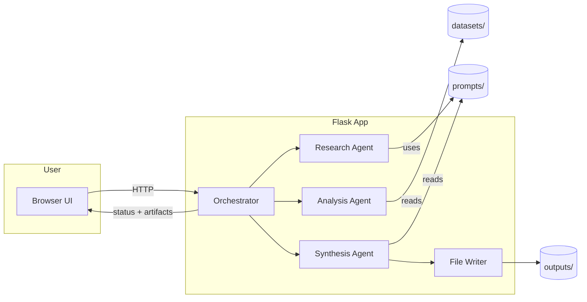
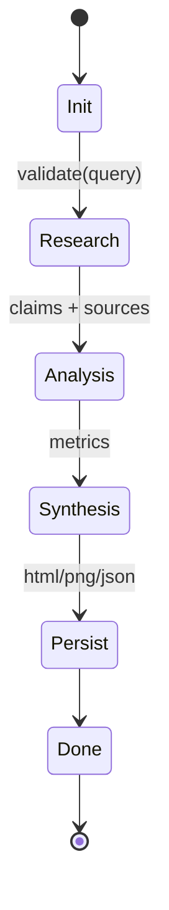
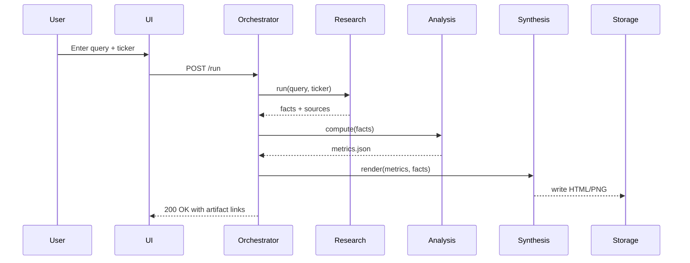
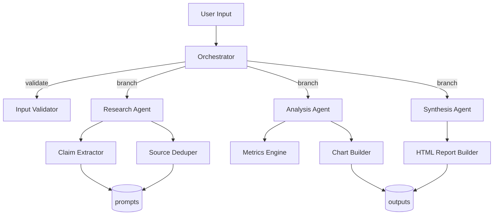

> **TL;DR**: Smart Financial Planner is a production-ready, agentic AI application that orchestrates specialized agents (Research, Analysis, Synthesis/Reporting, and UI) to evaluate assets, compute portfolio metrics (CAGR, Sharpe, Drawdown, Win-rate), and produce rich reports. The project follows Ready Tensor’s rubric: clear purpose, end-user value, technical credibility (tests + benchmarks), and complete documentation.

> **Visual note.** Diagrams below are rendered in Mermaid for portability (no binary assets required), and the prior `system-overview.png` hero has been removed so no PNG assets are generated or tracked.

---

# 1) Purpose & Value

**Purpose.** Provide an end-to-end, copy-runnable reference of an **agentic financial planner** that transforms a free-form research query (optionally a ticker) into a structured, cited, and charted investment brief.

**Value.**  
- **Speed to insight:** Automates desk-research → metrics → report.  
- **Explainability:** Outputs HTML/PNG/JSON artifacts that expose the pipeline and assumptions.  
- **Team-ready:** Clean repo, tests (smoke/load/eval), CI, and `.env`-based config.

---

# 2) Repository Map (What’s where?)

```
app/            # Core package: agents, graph (orchestration), services (metrics/charts), UI (Flask)
  __init__.py
  main.py       # Flask entrypoint, app factory, route mounting
  agents/
    research.py   # LLM + tools to gather facts/claims & sources
    analysis.py   # Metrics & risk calculations
    synthesis.py  # Narrative + chart composition; builds HTML
  graph/
    orchestrator.py  # Task graph / state hand-off; retries/timeouts
  services/
    metrics.py    # CAGR/Sharpe/Drawdown/Win-rate utilities
    charts.py     # Matplotlib chart helpers
  ui/
    routes.py     # HTTP handlers; input validation; artifact links
datasets/
prompts/
outputs/         # Generated reports/charts/metrics (gitignored)
tests/           # unit/, smoke/, load/, eval/
docs/
.github/
```

---

# 3) Deep Dive: Code, Modules, and Contracts

## 3.1 `app/main.py` — Flask App Factory & Wiring

**Responsibilities.**
- Create and configure the Flask app (`create_app()`).
- Register blueprints from `app.ui.routes`.
- Provide a dev-friendly entrypoint when using `flask --app app.main run`.

**Typical structure.**
```python
from flask import Flask
from .ui.routes import ui_bp

def create_app():
    app = Flask(__name__)
    app.register_blueprint(ui_bp)
    # optional: config from .env via python-dotenv if needed
    return app

# flask --app app.main run finds this `app` by convention
app = create_app()
```

**Why this matters.** Keeps the WSGI application (`app`) importable for production servers (e.g., Gunicorn: `gunicorn 'app.main:app'`).

---

## 3.2 `app/ui/routes.py` — HTTP Interface

**Responsibilities.**
- Render the main form and accept user inputs (`query`, optional `ticker`).
- Validate input; provide helpful errors, not stack traces.
- Kick off orchestration and return a link to generated artifacts in `outputs/`.

**Typical structure.**
```python
from flask import Blueprint, request, jsonify
from ..graph.orchestrator import run_pipeline

ui_bp = Blueprint("ui", __name__)

@ui_bp.post("/run")
def run():
    payload = request.get_json(force=True, silent=True) or request.form
    query = (payload.get("query") or "").strip()
    ticker = (payload.get("ticker") or "").strip() or None
    if not query:
        return jsonify(error="query is required"), 400
    result = run_pipeline(query, ticker)
    return jsonify(result), 200
```

**Contract.** Returns JSON with file paths/URLs of `outputs/*.html`, `*.png`, `*.json` for the frontend to display or link.

---

## 3.3 `app/graph/orchestrator.py` — Agentic Orchestration

**Responsibilities.**
- Define the control flow **Research → Analysis → Synthesis → Persist**.
- Manage state hand-offs, timeouts, retries, and circuit breakers (idempotent stages).
- Normalize/validate agent outputs; fail closed with clear error messages.
- Capture structured events for observability (timings, retries, cache hits).

**Key function.**
```python
from ..agents.research import ResearchAgent
from ..agents.analysis import AnalysisAgent
from ..agents.synthesis import SynthesisAgent

def run_pipeline(user_query: str, ticker: str | None) -> dict:
    research = ResearchAgent().run(user_query, ticker)
    metrics  = AnalysisAgent().compute(research)
    report   = SynthesisAgent().render(user_query, metrics, research)
    return persist_outputs(report, metrics, research)
```

**State shape (example).**
```python
# research output
{
  "claims": [{"claim":"...", "confidence":0.82, "source_id":"..."}, ...],
  "sources": [{"id":"...", "title":"...", "url":"..."}, ...],
  "notes": "normalized, de-duplicated extracts"
}
# metrics output
{"cagr":0.14, "sharpe":1.1, "drawdown":-0.22, "win_rate":0.57}
```

---

## 3.4 `app/agents/research.py` — Facts & Sources

**Responsibilities.**
- Turn a noisy query into **grounded claims** with **source attributions**.
- Apply prompt templates from `prompts/` (e.g., `extract_claims.txt`, `summarize.txt`).
- Produce normalized JSON for downstream agents.

**Typical structure.**
```python
from pathlib import Path
from ..services.io import load_prompt  # helper that reads prompts/*.txt

class ResearchAgent:
    def run(self, query: str, ticker: str | None):
        prompt = load_prompt("extract_claims.txt").format(query=query, ticker=ticker or "")
        # call LLM/tooling (omitted) -> returns structured JSON
        return normalize_llm_output(...)
```

**Output contract.**
- `claims`: list of {claim, confidence, source_id}.
- `sources`: list of {id, title, url}.

---

## 3.5 `app/agents/analysis.py` — Metrics Engine

**Responsibilities.**
- Compute risk/return metrics from price series or factor data.
- Encapsulate math in **pure functions** (easy to test).

**Typical structure.**
```python
from ..services.metrics import cagr, sharpe, max_drawdown, win_rate

class AnalysisAgent:
    def compute(self, research: dict) -> dict:
        prices = load_prices_from_sources(research["sources"])
        return {
            "cagr": cagr(prices),
            "sharpe": sharpe(prices),
            "drawdown": max_drawdown(prices),
            "win_rate": win_rate(prices),
        }
```

**Design choice.** Keep I/O thin; push formulae to `services/metrics.py` for single-responsibility & testability.

---

## 3.6 `app/agents/synthesis.py` — Report Builder

**Responsibilities.**
- Turn `metrics` + `research` into a **narrative** with **charts**.
- Create exportable artifacts: HTML (narrative), PNG (charts), JSON (raw metrics).

**Typical structure.**
```python
from ..services.charts import plot_price_projection
from jinja2 import Template  # or simple f-strings if minimal

class SynthesisAgent:
    def render(self, query: str, metrics: dict, research: dict) -> dict:
        chart_files = plot_price_projection(...)
        html = Template(READ_HTML_TEMPLATE()).render(metrics=metrics, research=research, charts=chart_files)
        return {"html": html, "charts": chart_files}
```

**Artifacts.**  
- `report_*.html`, `*_proj_5y.png`, `*_proj_10y.png`, `metrics_*.json`

---

## 3.7 `app/services/metrics.py` — Financial Utilities

**Responsibilities.**
- Pure, unit-testable math functions: `cagr`, `sharpe`, `max_drawdown`, `win_rate`.
- Validate inputs (NaNs, short series) and provide deterministic fallbacks.

**Sketch.**
```python
def cagr(prices): ...
def sharpe(prices, risk_free=0.0): ...
def max_drawdown(prices): ...
def win_rate(prices): ...
```

---

## 3.8 `app/services/charts.py` — Plotting

**Responsibilities.**
- Produce reproducible Matplotlib charts without global side effects.
- Save to `outputs/` and return file paths for the UI and HTML builder.

**Sketch.**
```python
import matplotlib.pyplot as plt
from pathlib import Path

def plot_price_projection(series, out_dir: Path) -> list[str]:
    out_dir.mkdir(parents=True, exist_ok=True)
    # generate and save figures, return file paths
    return [str(out_dir / "NVDA_proj_5y.png"), str(out_dir / "NVDA_proj_10y.png")]
```

---

## 3.9 `prompts/` — Behavior Outside Code

- `extract_claims.txt`, `summarize.txt`, `investability.txt`  
- Keep model behavior adjustable without redeploying code; version prompts via Git for auditability.

---

## 3.10 `tests/` — Quality Gates

- **`unit/`**: math utilities, serializers, and normalizers.  
- **`smoke/`**: imports & minimal pipeline run to catch fatal regressions quickly.  
- **`load/`**: `pytest-benchmark` benchmarks hot paths and exports JSON for trend comparison.  
- **`eval/`**: structure/threshold checks for metrics keys (CAGR/Sharpe/Drawdown/Win-rate).

**Run.**
```bash
pytest
pytest tests/smoke -q
pytest tests/load --benchmark-save=latest
pytest tests/eval -q
```

---

# 4) Architecture & Agentic Workflows

## 4.1 High-Level (Mermaid)


## 4.2 State Machine (Mermaid)


## 4.3 Sequence (Mermaid)


## 4.4 Extended Agent Graph (Mermaid)


## 4.5 Data Flow (Mermaid)
```mermaid
flowchart TB
  Q[Query] --> S1[Research Notes JSON]
  S1 --> S2[Metric Computation]
  S2 --> S3[Charts (PNG)]
  S1 --> S3
  S2 --> RPT[Report (HTML)]
  S3 --> RPT
  RPT --> OUT[(outputs/)]
```

## 4.6 Orchestration Framework (Explicit)

- **Execution model:** A directed task graph with named states (`research`, `analysis`, `synthesis`, `persist`). Each node is idempotent and guarded by timeouts, retry budgets, and circuit breakers to prevent cascading failures.
- **Message contract:** Every hand-off uses structured payloads (JSON schemas) with validation at the boundaries, ensuring downstream agents never receive partial or malformed data.
- **Concurrency & isolation:** Research and analysis tasks can be fanned out per ticker or source, while synthesis waits on both; side effects (disk writes, HTTP calls) are isolated to the orchestrator or dedicated workers.
- **Observability:** The orchestrator emits lifecycle events (start, success, retry, fail) with timestamps, latency buckets, and cache hits; these can be pushed to logs, OpenTelemetry spans, or a metrics sink.
- **Backpressure:** If downstream storage or external APIs slow down, the orchestrator can queue, shed low-priority jobs, or pause intake to keep latency predictable.
- **Workflow store:** State is durably persisted (e.g., SQLite or Redis) with idempotency keys so retries do not duplicate downstream writes.
- **Governance:** Each agent surfaces health signals (latency, failure rate, validation errors) that can trigger circuit breakers or dynamic throttling.

---

# 5) How to Run & Deploy

**Development.**
```bash
python -m venv .venv
source .venv/bin/activate   # Windows: .venv\Scripts\Activate.ps1
pip install -r requirements.txt -r requirements-dev.txt
cp .env.example .env
flask --app app.main run --port 5011 --debug
```

**Production (WSGI).**
```bash
pip install gunicorn
gunicorn -w 2 -b 0.0.0.0:5011 'app.main:app'
```

---

# 6) Security & Ethics

- Handle user queries as potentially sensitive; avoid storing raw texts unless necessary.  
- Keep API keys in `.env`; rotate regularly.  
- Outputs are **informational**, not financial advice.

---

# 7) Roadmap

- Market data APIs + fundamentals; scenario analysis.  
- Provider-agnostic LLM adapters; RAG for research notes.  
- Interactive viewer for generated reports; stricter eval thresholds in CI.

---

# 8) Appendix: Pseudocode for Metrics

```python
def _returns(prices):
    return [(prices[i]/prices[i-1])-1 for i in range(1, len(prices))]

def cagr(prices):
    r = _returns(prices); years = max(1e-9, len(r)/252)
    total = prices[-1]/prices[0]
    return total ** (1/years) - 1

def sharpe(prices, risk_free=0.0):
    r = _returns(prices); er = (sum(r)/len(r)) - (risk_free/252)
    # std dev (sample)
    import math
    mean = sum(r)/len(r)
    var = sum((x-mean)**2 for x in r)/(len(r)-1 or 1)
    sd = math.sqrt(var)
    return 0.0 if sd == 0 else (er/sd)* (252**0.5)

def max_drawdown(prices):
    peak = prices[0]; dd = 0.0
    for p in prices:
        peak = max(peak, p)
        dd = min(dd, p/peak - 1.0)
    return dd

def win_rate(prices):
    r = _returns(prices)
    return sum(1 for x in r if x>0)/len(r) if r else 0.0
```

---

## Front-Matter Notes (for strict parsers)

- Keep ASCII hyphens/quotes.  
- Quote values with spaces or colons.  
- Use list-of-strings for tags/authors.  
- Ensure the very first line is `---` with no leading BOM/whitespace.
